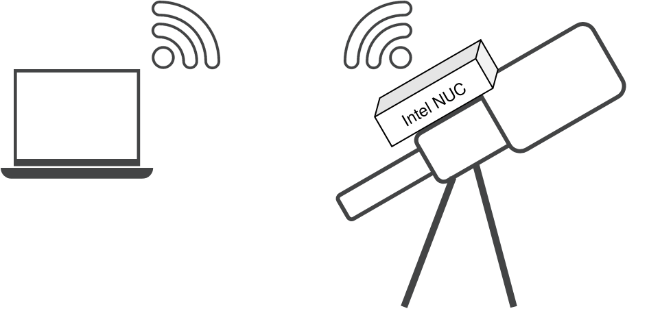

# INDILib Setup using Ansible for remote astrophotography 

This Ansible playbook automates the system setup by performing various tasks, including the installation of software packages, configuration of network settings, and setup of autologin.

## Goal


The goal of this project is to automate the configuration of a computer to enable remote access and control of a telescope using [INDILib](https://www.indilib.org/).

My personal use case is represented in the diagram above: an Intel NUC running Kubuntu is strapped to the telescope, and all hardware (telescope mount, cameras, etc.) is connected to it via USB.

More technically, this playbook does the following : 
 - Installs INDILib and KStars to control the telescope hardware ;
 - Installs [xrdp on the experimental branch implementing a GFX graphics pipeline](https://github.com/neutrinolabs/xrdp/discussions/2383) for a tremendous performance gain ;
 - Instruments NetworkManager to create a wifi hotspot ;
 - Configures SDDM to enable autologin (⚠️ TODO : support other login managers !)

Configuring all those components can be a complicated task, especially for non-tech-savvy people. Hence, the use of an automated script to install all of it.

## Installation

Referring to the diagram above, we call the laptop the *control node* and the NUC the *managed node*. We refer to the managed node's IP address as `<REMOTE_IP>`.

### On the managed node

1. Set up SSH access on the managed node :
```shell
sudo apt install openssh-server
sudo systemctl start ssh
sudo systemctl enable ssh
```

### On the control node

1. Clone this repo :
```bash
git clone https://github.com/Picoma/INDI-Library-setup-Ansible
cd INDI-Library-setup-Ansible 
``` 
2. Install Ansible on the control node [(link to the official Ansible documentation)](https://docs.ansible.com/ansible/latest/installation_guide/intro_installation.html#installing-and-upgrading-ansible-with-pip):
```bash
python3 -m venv .env_ansible
source .env_ansible/bin/activate
python3 -m pip install ansible
```
3. On your local machine, create then transfer an SSH key:
```bash
ssh-keygen -C "$USER@$HOSTNAME"
ssh-copy-id <REMOTE_IP>
```
4. Update the values in the [`hosts.ini`](src/hosts.ini) file with your desired values (refer to the [Configuration](#configuration) for details on the variables).
5. Run the playbook:
```bash
ansible-playbook -K -i hosts playbook.yml
```

## Usage
Once Ansible has successfully completed the configuration (all tasks set to OK status), you should be able to [remotely connect to the managed node via RDP](https://support.microsoft.com/en-us/windows/how-to-use-remote-desktop-5fe128d5-8fb1-7a23-3b8a-41e636865e8c).

## Configuration
The following parameters are to be configured in the [`hosts.ini`](src/hosts.ini) file :

- `ansible_host` : IP address of the managed node (earlier called `<REMOTE_IP>`)
- `ansible_user` : Username on the managed node
- `autologin_username`: Username for autologin.
- `autologin_session`: Desktop session for autologin.
- `ap_ssid`: SSID of the access point

## Roadmap
 - Add support for other login managers

## Contributing

Pull requests are welcome. For major changes, please open an issue first to discuss what you would like to change.

Tested on an Intel NUC running Kubuntu 22.04, but feel free to report problems on any Linux platform.

## License

[MIT](LICENCE)
